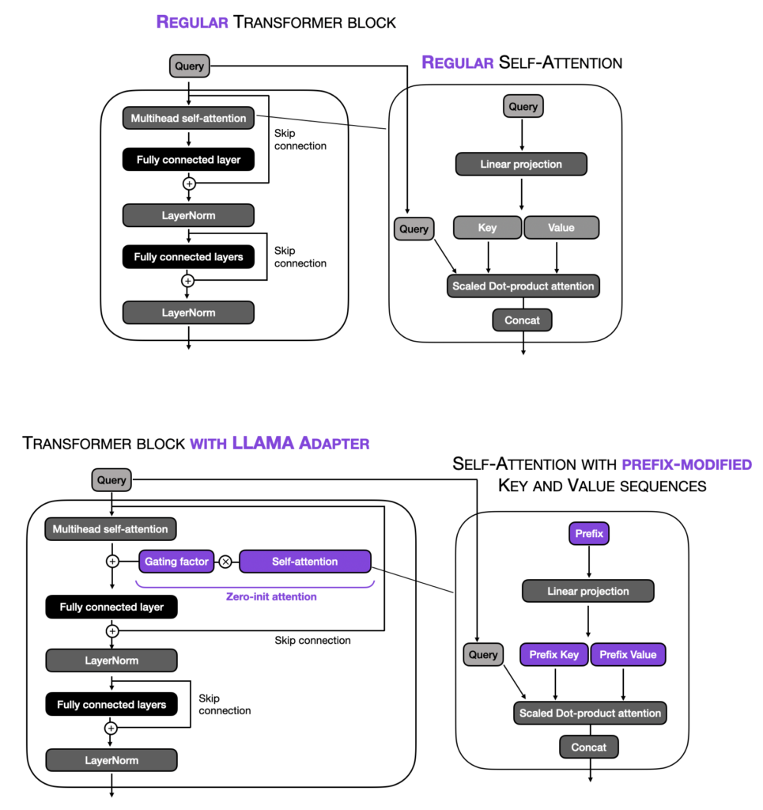

# [Llama Adapter: Efficient Fine-tuning of Language Models with Zero-init Attention] (https://arxiv.org/pdf/2303.16199)

## [LLama-Adapter Explanation 1](https://huggingface.co/docs/peft/en/conceptual_guides/adapter)

Llama-Adapter is a method for adapting Llama into a instruction-following model. 

To help adapt the Llama model for instruction-following, the adapter is trained with a 52K instruction-output dataset. Recall that an adapter can also be a neural network

A set of of learnable adaption prompts are prefixed to the input instruction tokens. 

These are inserted into the upper layers of the model because the upper layers are better at learning with the higher-level semantics of the pretrained model. 

The instruction-output tokens prefixed to the input guide the adaption prompt to generate a contextual response.

To avoid adding noise to the input tokens during fine-tuning, the adapter uses zero-initialized attention
- Ensures the fine-tuning process is clean and smooth because starting from zero helps the model avoid being overwhelmed by new information

The adapter also adds a learnable gating factor (initialized with zeros) to progressively add information to the model during training. This prevents overwhelming the model’s pretrained knowledge with the newly learned instructions.
- A learnable gating factor is also added to control how much new information gets introduced into the model during training.
Initially, this gating factor is set to zero, so the model doesn’t change too much right away.
As training progresses, the gating factor allows more new knowledge to be added gradually, making sure the model doesn’t get overloaded with new information all at once.

## [LLama-Adapter Explanation 2](https://lightning.ai/pages/community/article/understanding-llama-adapters/)

**LLaMa-Adapter**

Extending the ideas of prefix tuning and the original adapter method, researchers recently proposed LLaMA-Adapter (Zhang et al.), a parameter-efficient finetuning method for LLaMA (LLaMA is a popular GPT-alternative by Meta).

The prefix is initialised as a learnable/tunable tensor for each transformer block. Each transformer block in the model has its own distinct learned prefix, allowing for more tailored adaptation across different model layers.

The zero-initialised (zero-init) self-attetion of the Llama Adapter is calculated as a zero-initialised (zero-init) self-attetion between the original query, prefix-modified key and prefix-modified value (from the self-attention's original q,k,v). This results in a prefix-modified attention.

Then, depending on the gating factor (which is set to zero at the beginning of the training), the prefix-modified attention is either used or not. This is done to stabilise training.

Additionally, LLaMA-Adapter adds the learnable adaption prompts only to the L topmost transformer layers instead of all transformer layers. The authors argue that this approach enables more effective tuning of language representations focusing on higher-level semantic information.

The motivation behind the zero-init attention and gating is that adapters and prefix tuning could potentially disrupt the linguistic knowledge of the pretrained LLM by incorporating randomly initialized tensors (prefix prompts or adapter layers), resulting in unstable finetuning and high loss values during initial training phases.

## [LLama-Adapter Explanation 3, from the paper](https://arxiv.org/pdf/2303.16199)

**In Brief**

We present LLaMA-Adapter, a lightweight adaption method to efficiently finetune LLaMA into an instruction-following model. Using 52K instruction-output, LLaMA-Adapter only introduces 1.2M learnable parameters upon the frozen LLaMA 7B model.

Specifically, we adopt a set of learnable adaption prompts, and prepend them to the word tokens at higher transformer layers. Then, a zero-initialized attention mechanism with zero gating is proposed, which adaptively injects the new instructional cues into LLaMA, while effectively preserves its pre-trained
knowledge.

Besides language commands, our approach can be simply extended to multi-modal instructions for learning image-conditioned LLaMA model, which achieves superior reasoning performance on ScienceQA and COCO Caption benchmarks. 

We also utilize the 52K instruction-output data for training purposes, but freeze the entire LLaMA model with superior resource efficiency. 

Specifically, in LLaMA’s higher transformer layers, we append a set of learnable adaption prompts as prefix to the input instruction tokens. These prompts learn to adaptively inject new instructions (conditions) into the frozen LLaMA. 

To avoid noise from adaption prompts at the early training stage, we modify the vanilla attention mechanisms at inserted layers to be zero-initialized attention, with a learnable gating factor. Initialized by zero vectors, the gating can firstly preserve the original knowledge in LLaMA, and progressively incorporate instructional signals during training. This contributes to stable learning during the fine-tuning process and better instruction-following capacity of the final model.

1.2M Parameters. Instead of updating the full 7B parameters, we freeze the pre-trained
LLaMA and only learn the adaption prompts with 1.2M parameters on top. This, however,
reveals comparable instruction-following proficiency with the 7B Alpaca.

Multi-modal Instruction. Besides textual instruction, our approach can also take images as input for multi-modal reasoning. By adding image tokens into adaption prompts, LLaMAAdapter performs competitively on ScienceQA and COCO Captionbenchmarks.

**Compared to full fine-tuning**

This full-model fine-tuning can be inefficient in both time and memory, limiting its transferability to downstream applications. In contrast, our LLaMA-Adapter aims to fine-tune only lightweight adapters on top of the frozen LLaMA, other than updating parameters of the entire model.

**Compared to other PEFT**

The pre-training and fine-tuning paradigms have been proven to be highly effective in different language and vision tasks. Compared to full fine-tuning, ParameterEfficient Fine-Tuning (PEFT) methods freeze most parameters of pre-trained models, and can still exhibit comparable capabilities on downstream tasks

Prompt tuning appends a collection of trainable prompt tokens to pre-trained large models, which are inserted either to the input embeddings only, or to all of the intermediate layers

LoRA introduces trainable rank decomposition matrices into each network weights, which have indicated promising fine-tuning ability on large generative models 

Adapters insert lightweight adaption modules into each layer of the pre-trained transformer and have been extended across numerous domains 

In this paper, we propose a new PEFT method, LLaMA-Adapter, specially designed to adapt LLaMA into instruction-following model

Existing PEFT methods might potentially disturb the pre-trained linguistic knowledge by directly inserting randomly initialized modules. This leads to unstable fine-tuning with large loss values at early training stages. To this end, LLaMA-Adapter adopts a zero-initialized attention with gating factors to well mitigate such a issue, which progressively incorporates the instructional cues with the frozen LLaMA. 

**Learnable Adaption Prompts**

<u>Clarifications about instruction-output data</u>
- Instruction is the prompt given to the model
- Output is the expected response

"We denote the M-length word tokens as ... which represent the input instruction and the already generated response"
- In auto-regressive LLMs, the response is generated token by token. As each token is generated, it is added to the "already generated response." At each step, the model uses the input instruction and the partially generated response to predict the next token. In this case, the notation represents the combined input instruction and the partial response generated up to the current point.
- In sequence generation models, responses are generated iteratively. The model doesn’t predict the entire response at once but instead generates one word (or token) at a time. To predict the next token, the model needs to consider both: The input instruction (e.g., "Translate the sentence to Spanish"). The partial response generated so far (e.g., if the model has already predicted "Hola," it will use this to predict the next word). The learnable adaptation prompt is concatenated with the partially generated response and input instruction to guide the model's attention when generating the next token.

**Zero-initialised Attention**

**Multi-modal reasoning**

Methodology:

The LLaMA-Adapter is capable of answering a question based on input of other modalities, which augments the language model with rich cross-modal information

Key Ideas
- Visual encoder CLIP is used to extract multi-scale global features
- These features are added to the adaption prompts to create an adaption prompt incorporating visual information from the given image context
- In this way, LLaMA is fine-tuned to generate responses conditioned on vision-language inputs, and
can tackle more challenging generative tasks with multi-modal understanding

 
 
 
 
 

# Llama Adapter v2: Parameter-Efficient Visual Instruction Model

 
 
 
 
 

More
- https://huggingface.co/papers/2303.16199
- https://huggingface.co/docs/peft/v0.12.0/en/package_reference/llama_adapter
- https://www.emergentmind.com/papers/2304.15010
- https://github.com/OpenGVLab/LLaMA-Adapter
- https://sh-tsang.medium.com/review-llama-adapter-efficient-fine-tuning-of-language-models-with-zero-init-attention-f8529f4bfda0
- https://medium.com/@TechInsight/llama-adapter-efficient-fine-tuning-of-language-models-with-zero-init-attention-b0c517a602ed
- https://llama2-accessory.readthedocs.io/en/latest/finetune/sg_peft.html
- https://dl.acm.org/doi/10.1145/3652583.3657596
- https://spencerporter2.medium.com/unleashing-the-power-of-visual-instructions-with-llama-adapter-v2-91fdf1b4c6d
- https://huggingface.co/Alpha-VLLM/LLaMA2-Accessory

Code
- https://github.com/OpenGVLab/LLaMA-Adapter/tree/main
- https://github.com/OpenGVLab/LLaMA-Adapter/tree/main/llama_adapter_v2_multimodal7b
- https://github.com/OpenGVLab/LLaMA-Adapter/blob/main/llama_adapter_v2_multimodal7b/llama/llama.py
- https://github.com/OpenGVLab/LLaMA-Adapter/blob/main/llama_adapter_v2_multimodal7b/llama/llama_adapter.py

**Own Thoughts**
Maybe Llama adapter releases the full LLaMa model + LLama adapter because third party libraries don't integrate it

So you just need to load the weights maybe?

