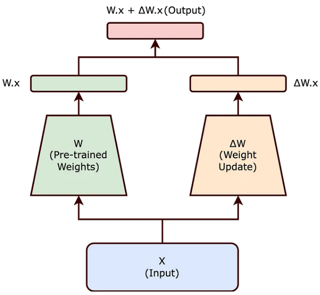
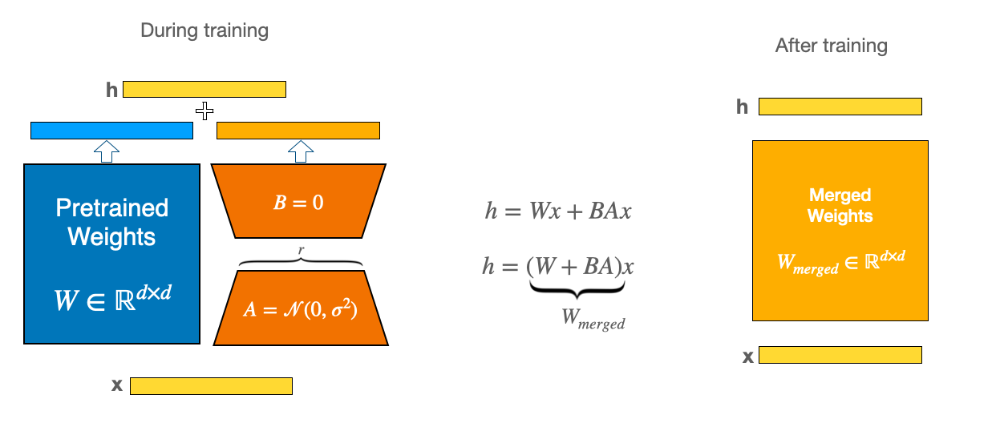

# LoRA

## **LoRA Explanation 1**

From this [link](https://medium.com/@AIBites/lora-low-rank-adaptation-of-llms-paper-explained-5ae866871c8a):

Adapters are trainable additional modules plugged into the neural network (mostly transformers). During fine-tuning, only the parameters of these adapter modules are updated, the parameters of the pre-trained model are frozen.

Because adapters are additional parameters, they introduce latency during inference

LoRA stands for Low-Rank Adaptation

**Low-Rank**

Weights of a network are just large matrices of numbers. All matrices come with a property called rank, which is the number of linearly independent rows or columns in a matrix

Quick Recap:

The rank of the simple 3 by 3 matrix at the top is 1 because the first and second columns are redundant as they are just multiples of the first column. In other words, the two columns are linearly dependent and don’t bring any meaningful information. 

If we change one of the values to 70, the rank becomes 2 as we now have two linearly independent columns.

**Rank Decomposition**

Knowing the rank of the matrix, we can do “Rank Decomposition” of a given matrix into two. 

Going back to the example of the 3 by 3 matrix, it can simply be written as the product of two matrices one with the dimension 3 by 1 and the other with the dimension 1 by 3.

^ calculation error but concept is there

Now, we only have to store 6 numbers after decomposition instead of the 9 numbers in the 3 by 3 matrix. 

This may sound little but in reality, weights can have a dimension of 1024 by 1024 and so using rank decomposition results in a lot of reduction in computation

It would be ideal if the weights have a low rank so that we can work with rank decomposition instead of the entire weights

**Training**

Let's say we are starting with a pre-trained model with weights W_0

After fine-tuning, let the weights be updated to W_0 + delta W

If the pre-trained model has low-rank weights, it would be a fair hypothesis to assume that the fine-tuned weights are also low-rank - LoRA goes with this assumption.

Because delta W is low-rank, we can decompose it into two low-rank matrices, A and B whose product BA leads to delta W. 

Lastly, finetuning becomes the pre-trained weights W0 + BA instead of W_0 + delta W as it is one and the same.

With this perspective, if we start training the model with input x, the input passes through both the pre-trained weights but also through A and B. 

The weights of the pre-trained model remain frozen. However, we still consider the output of the frozen model during training. 

The output of both the frozen model and the low-ranked model are summed up to obtain the output latent representation h.

**Inference**

There can be latency during inference for the above. But, if we slightly modify the above equation, we can notice that we can merge or add the weights BA to the pre-trained weights W_0. So, for inference, it is this merged weight that is deployed thereby overcoming the latency bottleneck.

**LoRA for Transformers**

LoRA is applied only to the self-attention module, adapting the attention weights for other tasks while freezing other modules in the Transformer

One of the key parameters in LoRA is the rank

 
 
 
 

## **LoRA Explanation 2**

From this [link](https://www.datacamp.com/tutorial/mastering-low-rank-adaptation-lora-enhancing-large-language-models-for-efficient-adaptation):

**The Problem**

Large language models like GPT-4, Claude 2, LLaMA 70b, etc., are great, but they are very generic and large. To adopt these large language models for specific domains like healthcare or banking or for specific tasks like converting text into code, we need something called fine-tuning.

Fine-tuning is the process of training a pre-trained model on a specific, smaller dataset to specialize its performance on a particular task or domain. As the models get larger (For example, GPT-3 has 175 billion parameters), full fine-tuning, which retrains all model parameters, becomes less feasible because of time, cost, and resources.

LoRA is a technique used for fine-tuning large models.

**How LoRA works**

At a high-level here is how LoRA works:

It keeps the original model unchanged and adds small, changeable parts to each layer of the model. This significantly reduces the trainable parameters of the model and reduces the GPU memory requirement for the training process, which is another significant challenge when it comes to fine-tuning or training large models.

For example, Full fine-tuning of the GPT-3 model will require us to train 175 billion parameters. Using LoRA, the trainable parameters for GPT-3 will be reduced roughly by 10,000 times and GPU memory requirements by three times.

In essence, LoRA solves these problems:

1. Speed - because less trainable parameters mean faster training
2. Compute Resources - less trainable parameters mean less compute resources required for the training process, making it financially viable to fine-tune large models.
3. Memory efficiency - less trainable parameters mean we can cache them in memory, eliminating the need for disk reads, which are inefficient compared to reading from memory.

**Lower-Rank Matrices**

A matrix is a rectangular array of numbers. For example, a 3x3 matrix has 3 rows and 3 columns

The rank of a matrix is determined by the number of linearly independent rows or columns in the matrix. Linearly independent means that no row (or column) can be formed by a combination of other rows (or columns).
If all rows (or columns) are linearly independent, the matrix has full rank.
If some rows (or columns) can be formed by combining other rows (or columns), the matrix has a lower rank.

A matrix is of lower rank if its rank is less than the maximum possible given its size. For example, in a 3x3 matrix, if the rank is less than 3, it's a lower rank matrix

Example:

The second row is just the first row multiplied by 2, and the third row is the first row multiplied by 3. This means the rows are not linearly independent. The rank of this matrix is 1 (since only the first row is independent), which is lower than the maximum possible rank for a 3x3 matrix, which is 3. So, this is a lower-rank matrix.

The rank in a matrix applies equally to both rows and columns. The crucial point to understand is that the rank of a matrix is the same whether you calculate it based on rows or columns. This is because of a fundamental property in linear algebra known as the Rank-Nullity Theorem.

In simpler terms, the theorem states that the dimensions of the row space (space spanned by the rows) and the column space (space spanned by the columns) of a matrix are equal. This common dimension is what we refer to as the rank of the matrix.

**LoRA**

In very simple words, LoRA leverages the concept of lower-rank matrices to make the model training process extremely efficient and fast.

Unlike traditional fine-tuning that requires adjusting the entire model, LoRA focuses on modifying a smaller subset of parameters (lower-rank matrices), thereby reducing computational and memory overhead.

First, we decompose the large weight matrices into smaller matrices using the lower-rank matrix technique, as explained above. This drastically reduces the number of trainable parameters. For a model like GPT-3, trainable parameters are reduced by 10000 times. This means instead of training 175 billion parameters, if you apply LoRA, you only have 17.5 million trainable parameters.

We do not change any parameters for a pre-trained model. Instead, only train lower-rank matrices, which happen relatively very quickly because of fewer parameters.

The weights are additive. This means for inference, we just add the weights of lower-rank matrices to pre-trained weights without any additional latency. The lower-rank matrices are very small in size as well so it is very easy to load and unload them for different tasks and different users.

**Advantages**

- LoRA reduces the computational burden, allowing faster adaptation of models. By requiring fewer trainable parameters, LoRA makes it feasible to fine-tune large models on less powerful hardware.

- LoRA does not introduce any additional latency during inference. While low-rank matrices are used during training, they are merged with the original parameters for inference, ensuring no slowdown. This enables rapid model switching at run time without additional inference latency.

**Combining LoRA with Prefix-Tuning**

Prefix tuning is a lightweight method where continuous vectors called "prefixes" are optimized and added to the input of each Transformer layer. The model is trained in a prefix-stripped manner, focusing only on these vectors.

LoRA and prefix tuning can be combined within the PEFT (Parameter Efficient Fine-Tuning) framework:

- LoRA reduces overall parameters, while prefix tuning provides task-specific control
- Together, they enable specialized fine-tuning with minimal data and compute
- Well suited for domain adaptation of large LLMs using limited in-domain data
- This modular fine-tuning unlocks the full potential of large LLMs for users with constrained resources.

## **LoRA Explanation 3**

From this [link](https://towardsdatascience.com/understanding-lora-low-rank-adaptation-for-finetuning-large-models-936bce1a07c6):

LoRA presented an effective solution to the traditional fine-tuning problem by decomposing the update matrix during finetuing

**Traditional Fine-tuning**

In traditional fine-tuning, we modify a pre-trained neural network’s weights to adapt to a new task. 

This adjustment involves altering the original weight matrix ( W ) of the network. 

The changes made to ( W ) during fine-tuning are collectively represented by ( Δ W ), such that the updated weights can be expressed as ( W + Δ W ).

Traditional finetuning can be reimagined below. Here W is frozen where as ΔW is trainable

**LoRA and The Intrinsic Rank Hypothesis**

<u>The intrinsic rank hypothesis</u> suggests that significant changes to the neural network can be captured using a lower-dimensional representation. Essentially, it posits that not all elements of ( Δ W ) are equally important; instead, a smaller subset of these changes can effectively encapsulate the necessary adjustments. 

Therefore, rather than modifying ( W ) directly, the LoRA approach seeks to decompose ( Δ W ). This decomposition is a crucial step in reducing the computational overhead associated with fine-tuning large models.

Building on this hypothesis, LoRA proposes representing ( Δ W ) as the product of two smaller matrices, ( A ) and ( B ), with a lower rank. The updated weight matrix ( W’ ) thus becomes:

[ W’ = W + BA ]

In this equation, ( W ) remains frozen (i.e., it is not updated during training). The matrices ( B ) and ( A ) are of lower dimensionality, with their product ( BA ) representing a low-rank approximation of ( Δ W ).

ΔW is decomposed into two matrices A and B where both have lower dimensionality then d x d

**Impact of LoRA**

By choosing matrices ( A ) and ( B ) to have a lower rank ( r ), the number of trainable parameters is significantly reduced. For example, if ( W ) is a ( d x d ) matrix, traditionally, updating ( W ) would involve ( d² ) parameters. However, with ( B ) and ( A ) of sizes ( d x r ) and ( r x d ) respectively, the total number of parameters reduces to ( 2dr ), which is much smaller when ( r << d ).

The reduction in the number of trainable parameters, as achieved through the Low-Rank Adaptation (LoRA) method, offers several significant benefits, particularly when fine-tuning large-scale neural networks:

- Reduced Memory Footprint: LoRA decreases memory needs by lowering the number of parameters to update, aiding in the management of large-scale models.
- Faster Training and Adaptation: By simplifying computational demands, LoRA accelerates the training and fine-tuning of large models for new tasks.
- Feasibility for Smaller Hardware: LoRA’s lower parameter count enables the fine-tuning of substantial models on less powerful hardware, like modest GPUs or CPUs.
- Scaling to Larger Models: LoRA facilitates the expansion of AI models without a corresponding increase in computational resources, making the management of growing model sizes more practical.

LoRA’s approach to decomposing ( Δ W ) into a product of lower rank matrices effectively balances the need to adapt large pre-trained models to new tasks while maintaining computational efficiency. The **intrinsic rank concept is key to this balance**, ensuring that the essence of the model’s learning capability is preserved with significantly fewer parameters.

## **LoRA Explanation 4**

From this [link](https://lush93md.medium.com/lora-parameter-efficient-fine-tuning-8b12face1894)

LoRA changes the game by adding a special twist to this formula:

output = W0x +b0 + BAx

In this new formula, A and B are smaller, more manageable grids of numbers (the rank-decomposition matrices). They’re like a mini-update pack for the model.

By doing this, we can achieve results similar to retraining the whole model (full fine-tuning), but with much less effort and computing power.

## **LoRA Explanation 5**

From this [link](https://developer.nvidia.com/blog/seamlessly-deploying-a-swarm-of-lora-adapters-with-nvidia-nim/)

## **LoRA Explanation 6**

From this [link](https://huggingface.co/docs/peft/main/en/conceptual_guides/lora)

To make fine-tuning more efficient, LoRA’s approach is to represent the weight updates with two smaller matrices (called update matrices) through low-rank decomposition. These new matrices can be trained to adapt to the new data while keeping the overall number of changes low. The original weight matrix remains frozen and doesn’t receive any further adjustments. To produce the final results, both the original and the adapted weights are combined.

LoRA makes fine-tuning more efficient by drastically reducing the number of trainable parameters.

In principle, LoRA can be applied to any subset of weight matrices in a neural network to reduce the number of trainable parameters. However, for simplicity and further parameter efficiency, in Transformer models LoRA is typically applied to attention blocks only. The resulting number of trainable parameters in a LoRA model depends on the size of the low-rank update matrices, which is determined mainly by the rank r and the shape of the original weight matrix.

