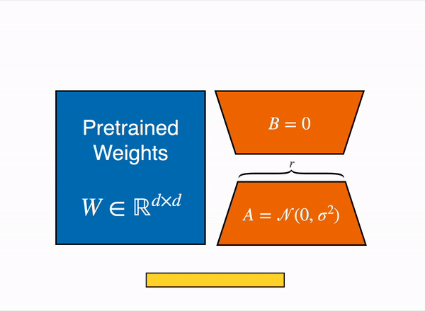
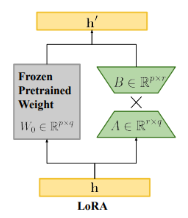

# Parameter-Efficient Fine-Tuning (PEFT) HuggingFace library


## [Overview](https://huggingface.co/docs/peft/en/index)

The HuggingFace PEFT Library is efficient for adapting large pretrained models to various downstream applications without fine-tuning all of a model’s parameters because it is prohibitively costly.

PEFT methods only fine-tune a small number of (extra) model parameters - significantly decreasing computational and storage costs - while yielding performance comparable to a fully fine-tuned model.

## [Adapters](https://huggingface.co/docs/peft/en/conceptual_guides/adapter)

**LoRA**

LoRA represents the weight updates ∆W with two smaller matrices (called update matrices) through low-rank decomposition. These new matrices can be trained to adapt to the new data while keeping the overall number of parameters low. The original weight matrix remains frozen and doesn’t receive any further updates. To produce the final results, the original and extra adapted weights are combined. 



In principle, LoRA can be applied to any subset of weight matrices in a neural network to reduce the number of trainable parameters. However, for simplicity and further parameter efficiency, LoRA is typically only applied to the attention blocks in Transformer models. The resulting number of trainable parameters in a LoRA model depends on the size of the update matrices, which is determined mainly by the rank r and the shape of the original weight matrix.



X: Matrix Product

**LLama-Adapter**

Llama-Adapter is a method for adapting Llama into a instruction-following model. 

To help adapt the Llama model for instruction-following, the adapter is trained with a 52K instruction-output dataset. Recall that an adapter can also be a neural network

A set of of learnable adaption prompts are prefixed to the input instruction tokens. 

These are inserted into the upper layers of the model because the upper layers are better at learning with the higher-level semantics of the pretrained model. 

The instruction-output tokens prefixed to the input guide the adaption prompt to generate a contextual response.

To avoid adding noise to the input tokens during fine-tuning, the adapter uses zero-initialized attention
- Ensures the fine-tuning process is clean and smooth because starting from zero helps the model avoid being overwhelmed by new information

The adapter also adds a learnable gating factor (initialized with zeros) to progressively add information to the model during training. This prevents overwhelming the model’s pretrained knowledge with the newly learned instructions.
- A learnable gating factor is also added to control how much new information gets introduced into the model during training.
Initially, this gating factor is set to zero, so the model doesn’t change too much right away.
As training progresses, the gating factor allows more new knowledge to be added gradually, making sure the model doesn’t get overloaded with new information all at once.

## [QuickStart](https://huggingface.co/docs/peft/en/quicktour)

PEFT offers parameter-efficient methods for finetuning large pretrained models. The traditional paradigm is to finetune all of a model’s parameters for each downstream task, but this is becoming exceedingly costly and impractical because of the enormous number of parameters in models today. 

Instead, it is more efficient to train a smaller number of prompt parameters or use a reparametrization method like low-rank adaptation (LoRA) to reduce the number of trainable parameters.

**Train**

Each PEFT method is defined by it's PEFT configuration class that stores the configuration of the Peft model

For example to train with LoRA we can load the [LoraConfig](https://huggingface.co/docs/peft/v0.12.0/en/package_reference/lora#peft.LoraConfig) class:

```
from peft import LoraConfig, TaskType

peft_config = LoraConfig(task_type=TaskType.SEQ_2_SEQ_LM, inference_mode=False, r=8, lora_alpha=32, lora_dropout=0.1)
```

Parameters
- task_type: the task to train for (sequence-to-sequence language modeling in this case)
- inference_mode: whether you’re using the model for inference or not
- r: the dimension of the low-rank matrices
- lora_alpha: the scaling factor for the low-rank matrices
- lora_dropout: the dropout probability of the LoRA layers

Next, we load the base model we would like to fine-tune, for example

```
from transformers import AutoModelForSeq2SeqLM

model = AutoModelForSeq2SeqLM.from_pretrained("bigscience/mt0-large")
```

We can then create the [PeftModel](https://huggingface.co/docs/peft/v0.12.0/en/package_reference/peft_model#peft.PeftModel) with the [get_peft_model()](https://huggingface.co/docs/peft/v0.12.0/en/package_reference/peft_model#peft.get_peft_model) function
- The ```get_peft_model()``` function takes a base model and the peft config containing the parameters for how to configure the model for training with the specified peft method

```
from peft import get_peft_model

model = get_peft_model(model, peft_config)
model.print_trainable_parameters()
"output: trainable params: 2359296 || all params: 1231940608 || trainable%: 0.19151053100118282"
```

Now we can train the model with the Transformer library's Trainer, Accelerate or custom PyTorch training loop

Example of training with the Trainer class

```
training_args = TrainingArguments(
    output_dir="your-name/bigscience/mt0-large-lora",
    learning_rate=1e-3,
    per_device_train_batch_size=32,
    per_device_eval_batch_size=32,
    num_train_epochs=2,
    weight_decay=0.01,
    evaluation_strategy="epoch",
    save_strategy="epoch",
    load_best_model_at_end=True,
)

trainer = Trainer(
    model=model,
    args=training_args,
    train_dataset=tokenized_datasets["train"],
    eval_dataset=tokenized_datasets["test"],
    tokenizer=tokenizer,
    data_collator=data_collator,
    compute_metrics=compute_metrics,
)

trainer.train()
```

In general the steps of training a model with one of HuggingFace's PEFT method are as follows:
1. Prepare a PeftConfig for a PEFT method
2. Use the ```get_peft_model()``` method to create a PeftModel from the configuration and base model

<br/>
<br/>
<br/>

## [PEFT Integration](https://huggingface.co/docs/peft/en/tutorial/peft_integrations)

Load a base pretrained model to train.

```
from transformers import AutoModelForCausalLM

model = AutoModelForCausalLM.from_pretrained("facebook/opt-350m")
```

Add an adapter configuration to specify how to adapt the model parameters. Call the [add_adapter()](https://huggingface.co/docs/peft/v0.12.0/en/package_reference/peft_model#peft.PeftModel.add_adapter) method to add the configuration to the base model.

```
from peft import LoraConfig

peft_config = LoraConfig(
    lora_alpha=16,
    lora_dropout=0.1,
    r=64,
    bias="none",
    task_type="CAUSAL_LM"
)
model.add_adapter(peft_config)
```

Now you can train the model with Transformer’s Trainer class or whichever training framework you prefer.

[**Load Adapters with HuggingFace PEFT**](https://huggingface.co/docs/transformers/v4.44.2/peft)

Parameter-Efficient Fine Tuning (PEFT) methods freeze the pretrained model parameters during fine-tuning and add a small number of trainable parameters (the adapters) on top of it. The adapters are trained to learn task-specific information. This approach has been shown to be very memory-efficient with lower compute usage while producing results comparable to a fully fine-tuned model.

Installation:

```
pip install peft

or

pip install git+https://github.com/huggingface/peft.git
```

Load a PEFT Adapter by itself ?:
- Make sure the HuggingFace Hub contains the PEFT Adapter model (or a local directory with ```adapter_config.json``` file and the adapter weights?)

```
from transformers import AutoModelForCausalLM, AutoTokenizer

peft_model_id = "ybelkada/opt-350m-lora"
model = AutoModelForCausalLM.from_pretrained(peft_model_id)
```

Load a PEFT adapter into a model:

HuggingFace Transformers natively supports some PEFT methods, meaning you can load adapter weights stored locally or on the Hub and easily run or train them with a few lines of code. The following methods are supported:
- Low Rank Adapters
- IA3
- AdaLoRA

If you want to use other PEFT methods, such as prompt learning or prompt tuning please refer to the documentation.

```
from transformers import AutoModelForCausalLM, AutoTokenizer

model_id = "facebook/opt-350m"
peft_model_id = "ybelkada/opt-350m-lora"

model = AutoModelForCausalLM.from_pretrained(model_id)
model.load_adapter(peft_model_id)
```

Another way?

```
from transformers import AutoModelForCausalLM, OPTForCausalLM, AutoTokenizer
from peft import PeftConfig

model_id = "facebook/opt-350m"
adapter_model_id = "ybelkada/opt-350m-lora"
tokenizer = AutoTokenizer.from_pretrained(model_id)
text = "Hello"
inputs = tokenizer(text, return_tensors="pt")

model = AutoModelForCausalLM.from_pretrained(model_id)
peft_config = PeftConfig.from_pretrained(adapter_model_id)

# to initiate with random weights
peft_config.init_lora_weights = False

model.add_adapter(peft_config)
model.enable_adapters()
output = model.generate(**inputs)
```

Training the PEFT Adapter with the model
- Remember to enable the adapter module

```
from peft import LoraConfig

peft_config = LoraConfig(
    lora_alpha=16,
    lora_dropout=0.1,
    r=64,
    bias="none",
    task_type="CAUSAL_LM",
)

model.add_adapter(peft_config)

trainer = Trainer(model=model, ...)
trainer.train()
```

Side track: [Fine-tuning a pre-trained model in HF](https://huggingface.co/docs/transformers/v4.44.2/training)

Quantization (loading in 8bit or 4bit)

The bitsandbytes integration supports 8bit and 4bit precision data types, which are useful for loading large models because it saves memory (see the [bitsandbytes integration](https://huggingface.co/docs/transformers/v4.44.2/quantization/overview#bitsandbytes-integration) guide to learn more). Add the load_in_8bit or load_in_4bit parameters to from_pretrained() and set device_map="auto" to effectively distribute the model to your hardware

```
from transformers import AutoModelForCausalLM, AutoTokenizer, BitsAndBytesConfig

peft_model_id = "ybelkada/opt-350m-lora"
model = AutoModelForCausalLM.from_pretrained(peft_model_id, quantization_config=BitsAndBytesConfig(load_in_8bit=True))
```

More
- [PEFT Blog](https://huggingface.co/blog/peft)
- [Adapters Add-On Library to Transformers](https://huggingface.co/docs/hub/en/adapters)
- [Adapters Library on GitHub](https://github.com/adapter-hub/adapters)
- [Adapters Library: Loading Pre-trained adapters](https://docs.adapterhub.ml/loading.html)
- [Adapters Library](https://adapterhub.ml/)
- [Adapters Library Introduction](https://adapterhub.ml/blog/2023/11/introducing-adapters/)