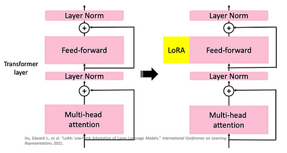

# Parameter-Efficient Fine-Tuning (PEFT)

## PEFT Explanation 1

From this [link](https://www.ibm.com/think/topics/parameter-efficient-fine-tuning)

**What's PEFT**

Parameter-efficient fine-tuning (PEFT) is a method of improving the performance of pretrained large language models (LLMs) for specific tasks. By training a small set of parameters and preserving most of the large pretrained model’s structure, PEFT saves time and computational resources.

**How does PEFT work**

PEFT works by freezing most of the pretrained language model’s parameters and layers while adding a few trainable parameters, known as adapters, to the final layers for predetermined downstream tasks.

The fine-tuned models retain all the learning gained during training while specializing in their respective downstream tasks. 

Many PEFT methods further enhance efficiency with gradient checkpointing, a memory-saving technique that helps models learn without storing as much information at once.

**PEFT vs Fine-Tuning**

Traditional full fine-tuning methods involve slight adjustments to all the parameters in pretrained LLMs to adapt them for specific tasks. But as developments in artificial intelligence (AI) and deep learning (DL) have led models to grow larger and more complex, the fine-tuning process has become too demanding on computational resources and energy.

Also, each fine-tuned model is the same size as the original. All these models take up significant amounts of storage space, further driving up costs for the organizations that use them. While fine-tuning does create more efficient machine learning (ML), the process of fine-tuning LLMs has itself become inefficient.

PEFT adjusts the handful of parameters that are most relevant to the model’s intended use case to deliver specialized model performance while reducing model weights for significant computational cost and time savings.

**PEFT Benefits**

- No Catastrophic Forgetting: Catastrophic forgetting happens when LLMs lose or “forget” the knowledge gained during the initial training process as they are retrained or tuned for new use cases. Because PEFT preserves most of the initial parameters, it also safeguards against catastrophic forgetting.

Amongst others

**PEFT Techniques**

1. Adapters

Adapter modules are small add-ons that insert a handful of trainable, task-specific parameters into each transformer layer of the model.

2. LoRA

Low-rank adaption of large language models (LoRA) uses twin low-rank decomposition matrices to minimize model weights and reduce the subset of trainable parameters even further.

3. Prefix-Tuning

Specifically created for natural language generation (NLG) models, prefix-tuning appends a task-specific continuous vector, known as a prefix, to each transformer layer while keeping all parameters frozen. As a result, prefix-tuned models store over a thousandfold fewer parameters than fully fine-tuned models with comparable performance

## PEFT Explanation 2

From this [link](https://www.ml6.eu/blogpost/peft-parameter-efficient-fine-tuning)

1. Prefix Tuning

Prefix tuning adds a trainable prefix to the input of the LLM, modifying its learned representation

Use it when you need to modify the representations learned by the LLM for a specific task. To modify learned representations.

2. LoRA

LoRA adapts a LLM by modifying the attention mechanism, the part of the model that decides which information is important and which is not. It does so through a low-rank matrix factorisation which learns task-specific attention patterns. 

For task-specific attention patterns.

3. Adapters

Adapters are small neural network modules inserted into LLMs to adapt them for executing new tasks. During fine-tuning, only the weights of the adapter are learned.

For multiple tasks on the same model

## PEFT Explanation 3

From this [link](https://www.leewayhertz.com/parameter-efficient-fine-tuning/)

**Problem**

With the parameter count of large language models reaching trillions, fine-tuning the entire model has become computationally expensive and often impractical

PEFT aims to fine-tune only a small subset of the model’s parameters, achieving comparable performance to full fine-tuning while significantly reducing computational requirements

**Terms**

Parameters: Parameters are the values/variables that a model learns during training to make predictions or classifications on new data. Parameters are usually represented as weights and biases in neural networks, and they control how the input data is transformed into output predictions.

Fine-tuning: Fine-tuning is a specific type of transfer learning where the pre-trained model’s weights are adjusted or fine-tuned on a new task-specific dataset. The pre-trained model is used as a starting point in this process, but the weights are adjusted during training to fit the new data better. The amount of fine-tuning can vary depending on the amount of available data and the similarity between the original and new tasks.

A PEFT model is a pre-trained model that has been fine-tuned using the parameter-efficient fine-tuning technique. A PEFT model starts as a general-purpose model trained on vast amounts of data to learn a broad understanding of language or image patterns. The fine-tuning process then adapts this model to perform well on more specific tasks by modifying only a select few parameters rather than the entire network

**Standard Fine-Tuning**

A standard fine-tuning process involves adjusting the hidden representations (h) extracted by transformer models to enhance their performance in downstream tasks. These hidden representations refer to any features the transformer architecture extracts, such as the output of a transformer layer or a self-attention layer.

To illustrate, suppose we have an input sentence, “This is a total waste of money.” Before fine-tuning, the transformer model computes the hidden representations (h) of each token in the sentence. After fine-tuning, the model’s parameters are updated, and the updated parameters will generate a different set of hidden representations, denoted by h’. Thus, the hidden representations generated by the pre-trained and fine-tuned models will differ even for the same sentence.

In essence, fine-tuning is a process that modifies the pre-trained language model’s hidden representations to make them more suitable for downstream tasks. However, fine-tuning all the parameters in the model is not necessary to achieve this goal.

**Adapters (In line)**

Adapters are a submodule that can be added to pre-trained language models to modify their hidden representation during fine-tuning. 

By inserting adapters after the multi-head attention and feed-forward layers in the transformer architecture, we can update only the parameters in the adapters during fine-tuning while keeping the rest of the model parameters frozen.

Adopting adapters can be a straightforward process. All that is required is to add adapters into each transformer layer and place a classifier layer on top of the pre-trained model. 

By updating the parameters of the adapters and the classifier head, we can improve the performance of the pre-trained model on a particular task without updating the entire model. This approach can save time and computational resources while still producing impressive results.

The adapter module comprises two feed-forward projection layers connected with a non-linear activation layer. There is also a skip connection that bypasses the feed-forward layers.

If we take the adapter placed right after the multi-head attention layer, then the input to the adapter layer is the hidden representation h calculated by the multi-head attention layer. Here, h takes two different paths in the adapter layer; one is the skip-connection, which leaves the input unchanged, and the other way involves the feed-forward layers.

Initially, the first feed-forward layer projects h into a low-dimension space. This space has a dimension less than h. Following this, the input is passed through a non-linear activation function, and the second feed-forward layer then projects it back up to the dimensionality of h. The results obtained from the two ways are summed together to obtain the final output of the adapter module.

The skip-connection preserves the original input h of the adapter, while the feed-forward path generates an incremental change, represented as Δh, based on the original h. By adding the incremental change Δh, obtained from the feed-forward layer with the original h from the previous layer, the adapter modifies the hidden representation calculated by the pre-trained model. This allows the adapter to alter the hidden representation of the pre-trained model, thereby changing its output for a specific task.

**LoRA (In parallel)**

 LoRA is also a small trainable submodule that can be inserted into the PEFT transformer architecture.

 It involves freezing the pre-trained model weights and injecting trainable rank decomposition matrices into each layer of the transformer architecture, greatly diminishing the number of trainable parameters for downstream tasks.

 LoRA has no additional inference latency compared to other methods.

 LoRA is inserted in parallel to the modules in the pre-trained transformer model, specifically in parallel to the feed-forward layers.

 A feed-forward layer has two projection layers and a non-linear layer in between them, where the input vector is projected into an output vector with a different dimensionality using an affine transformation. The LoRA layers are inserted next to each of the two feed-forward layers.

 

 Consider the feed-forward up-project layer and the LoRA next to it
 - The original parameters of the feed-forward layer take the output from the previous layer with the dimension dmodel and projects it into dFFW. Here, FFW is the abbreviation for feed-forward.
 - The LoRA module placed next to it consists of two feed-forward layers. The LoRA’s first feed-forward layer takes the same input as the feed-forward up-project layer and projects it into an r-dimensional vector, which is far less than the dmodel. Then, the second feed-forward layer projects the vector into another vector with a dimensionality of dFFW.
 - Finally, the two vectors are added together to form the final representation.

 

 Another way to look at it from the LoRA document:

 

 

 Emphasis that it is between input x and hidden representation h!

 Fine-tuning is changing the hidden representation h calculated by the original transformer model. Hence, in this case, the hidden representation calculated by the feed-forward up-project layer of the original transformer is h. Meanwhile, the vector calculated by LoRA is the incremental change Δh that is used to modify the original h. Thus, the sum of the original representation and the incremental change is the updated hidden representation h’.

 By inserting LoRA modules next to the feed-forward layers and a classifier head on top of the pre-trained model, task-specific parameters for each task are kept to a minimum.

**Pitfalls**

Overfitting: PEFT’s reliance on fine-tuning a limited number of parameters raises the risk of overfitting to the training dataset. Employ regularization methods such as weight decay and dropout to mitigate this risk. Additionally, monitoring validation loss can provide early indicators of overfitting, enabling timely adjustments to training protocols.

## PEFT Explanation 3

From this [link](https://www.theaidream.com/post/fine-tuning-large-language-models-llms-using-peft)

Parametric efficient fine-tuning (PEFT) is a methodology used in transfer learning to efficiently fine-tune large pre-trained models without modifying most of their original parameters. PEFT aims to minimize the storage requirements and computation cost associated with traditional fine-tuning approaches

PEFT strategies involve adjusting only a limited number of additional model parameters while keeping the majority of the pretrained Language Model (LLM) parameters fixed. This results in a significant reduction in computational and storage requirements. Notably, PEFT addresses the challenges associated with catastrophic forgetting, a phenomenon observed when fully fine-tuning LLMs.

In short, PEFT approaches enable you to get performance comparable to full fine-tuning while only having a small number of trainable parameters.

**Adapters**

Adapters are special submodules added to pre-trained language models, modify hidden representations during fine-tuning. Positioned after specific layers in the transformer architecture, adapters enable updating their parameters while keeping the rest of the model frozen. This straightforward adoption involves inserting adapters into each transformer layer and adding a classifier layer atop the pre-trained model. 

Updating adapter and classifier head parameters enhances task-specific performance without modifying the entire model, saving time and computational resources.

**LoRA**

LoRA (Low-Rank Adaptation) is a fine-tuning approach for large language models, akin to adapters. It introduces a small trainable submodule into the transformer architecture, freezing pre-trained model weights, and incorporating trainable rank decomposition matrices in each layer. This significantly reduces trainable parameters for downstream tasks

More Resources
- https://www.mercity.ai/blog-post/fine-tuning-llms-using-peft-and-lora#adapters
- https://developer.nvidia.com/blog/seamlessly-deploying-a-swarm-of-lora-adapters-with-nvidia-nim/

## PEFT Explanation 4

From this [link](https://lightning.ai/pages/community/article/understanding-llama-adapters/)

Since GPT-2 and GPT-3, we have seen that generative large language models (LLMs) pretrained on a general text corpus are capable of in-context learning, which doesn’t require us to further train or finetune pretrained LLMs if we want to perform specific or new tasks that the LLM wasn’t explicitly trained on. Instead, we can directly provide a few examples of a target task via the input prompt, as illustrated in the example below.

In-context learning is a valuable and user-friendly method for situations where direct access to the large language model (LLM) is limited, such as when interacting with the LLM through an API or user interface.
However, if we have access to the LLM, adapting and finetuning it on a target task using data from a target domain usually leads to superior results.

In-context learning only applies to generative models. It’s also worth highlighting that when we finetune generative models, we work with and build on the embeddings they create instead of the generated output texts.

What if we want to finetune larger models that only barely fit into GPU memory, for example, the latest generative LLMs?

Over the years, researchers developed several techniques (Lialin et al.) to finetune LLM with high modeling performance while only requiring the training of only a small number of parameters. These methods are usually referred to as parameter-efficient finetuning techniques (PEFT).

Some of the most widely used PEFT techniques are summarized in the figure below.

LLaMA-Adapter is model-agnostic despite being proposed for the LLaMa model. It is related to 2 techniques: Pre-fix tuning and adapters

**Prompt Tuning and Prefix Tuning**

The original concept of prompt tuning refers to techniques that vary the input prompt to achieve better modeling results. 

For example, suppose we are interested in translating an English sentence into German. We can ask the model in various different ways, as illustrated below.

This concept is called <u>hard prompt tuning</u> since we directly change the discrete input tokens (the words in the prompt itself)

In <u>soft prompt tuning</u>, specifically <u>prefix tuning</u>, the idea is to add the input embeddings (vary the input similar to above) and a trainable tensor to each transformer block that is to be optimized via backpropagation to improve the modeling performance on a target task. 
- Prepending prefixes to the input embeddings
- Prepends tunable prompt tensors to the embedded inputs
- Prepending tunable soft prompts

The "Fully Connected Layers" refer to a small Multilayer Perceptron (2 Fully connected layers with a nonlinear activation function in-between). These fully connected layers embed the soft prompt in a feature space with the same dimensionality as the transformer-block input to ensure compatibility for concatenation.

In code:

According to the original prefix tuning paper, prefix tuning achieves comparable modeling performance to finetuning all layers while only requiring the training of 0.1% of the parameters — the experiments were based on GPT-2 models. Moreover, in many cases, prefix tuning even outperformed the finetuning of all layers, which is likely because fewer parameters are involved, which helps reduce overfitting on smaller target datasets.

**Adapters**

The adapter adds adapter layers in 2 places to each transformer block

In code:

Note that the fully connected layers of the adapters are usually relatively small and have a bottleneck structure similar to autoencoders. Each adapter block’s first fully connected layer projects the input down onto a low-dimensional representation. The second fully connected layer projects the input back into the input dimension. How is this parameter efficient? For example, assume the first fully connected layer projects a 1024-dimensional input down to 24 dimensions, and the second fully connected layer projects it back into 1024 dimensions. This means we introduced 1,024 x 24 + 24 x 1,024 = 49,152 weight parameters. In contrast, a single fully connected layer that reprojects a 1024-dimensional input into a 1,024-dimensional space would have 1,024 x 1024 = 1,048,576 parameters.

**Prefix vs Adapters**

According to the original adapter paper, a BERT model trained with the adapter method reaches a modeling performance comparable to a fully finetuned BERT model while only requiring the training of 3.6% of the parameters.

Now, the question is how the adapter method compares to prefix tuning. Based on the original prefix tuning paper, the adapter method performed slightly worse than the prefix tuning method when 0.1% of the total number of model parameters were tuned. 

However, when the adapter method is used to tune 3% of the model parameters, the method ties with prefix tuning of 0.1% of the model parameters. So, we may conclude that the prefix tuning method is the more efficient of the two.

**LLaMa-Adapter**

Extending the ideas of prefix tuning and the original adapter method, researchers recently proposed LLaMA-Adapter (Zhang et al.), a parameter-efficient finetuning method for LLaMA (LLaMA is a popular GPT-alternative by Meta).

The prefix is initialised as a learnable/tunable tensor for each transformer block. Each transformer block in the model has its own distinct learned prefix, allowing for more tailored adaptation across different model layers.

The zero-initialised (zero-init) self-attetion of the Llama Adapter is calculated as a zero-initialised (zero-init) self-attetion between the original query, prefix-modified key and prefix-modified value (from the self-attention's original q,k,v). This results in a prefix-modified attention.

Then, depending on the gating factor (which is set to zero at the beginning of the training), the prefix-modified attention is either used or not. This is done to stabilise training.

Additionally, LLaMA-Adapter adds the learnable adaption prompts only to the L topmost transformer layers instead of all transformer layers. The authors argue that this approach enables more effective tuning of language representations focusing on higher-level semantic information.

The motivation behind the zero-init attention and gating is that adapters and prefix tuning could potentially disrupt the linguistic knowledge of the pretrained LLM by incorporating randomly initialized tensors (prefix prompts or adapter layers), resulting in unstable finetuning and high loss values during initial training phases.

## PEFT Expalantion 5: Prefix Tuning

From this 
- [link](https://huggingface.co/docs/peft/main/en/task_guides/seq2seq-prefix-tuning)
- [link](https://huggingface.co/docs/peft/main/en/task_guides/prompt_based_methods)
- [link](https://huggingface.co/docs/peft/main/en/conceptual_guides/prompting)

Prefix tuning is an additive method where only a sequence of continuous task-specific vectors is attached to the beginning of the input, or prefix. Only the prefix parameters are optimized and added to the hidden states in every layer of the model. The tokens of the input sequence can still attend to the prefix as virtual tokens. As a result, prefix tuning stores 1000x fewer parameters than a fully finetuned model, which means you can use one large language model for many tasks.

Prefix tuning was designed for natural language generation (NLG) tasks on GPT models. It is very similar to prompt tuning; prefix tuning also prepends a sequence of task-specific vectors to the input that can be trained and updated while keeping the rest of the pretrained model’s parameters frozen.

The main difference is that the prefix parameters are inserted in all of the model layers, whereas prompt tuning only adds the prompt parameters to the model input embeddings. The prefix parameters are also optimized by a separate feed-forward network (FFN) instead of training directly on the soft prompts because it causes instability and hurts performance. The FFN is discarded after updating the soft prompts.

As a result, the authors found that prefix tuning demonstrates comparable performance to fully finetuning a model, despite having 1000x fewer parameters, and it performs even better in low-data settings.