# LARGE LANGUAGE MODELS ARE EFFICIENT LEARNERS OF NOISE-ROBUST SPEECH RECOGNITION

[Link](https://d1qx31qr3h6wln.cloudfront.net/publications/arxiv_iclr24_llm_asr.pdf)

[GitHub](https://github.com/YUCHEN005/RobustGER)

**Overview**

Teach LLMs to perform denoising for GER just like what robust ASR do

A language-space denoising process

Extract a language-space noise embedding from the N-best list to represent the noise conditions of source speech, which can promote the denoising process in GER

To enhance representation ability of audio noise, design a knowledge distillation approach to distill real noise information in audio embeddings 

Up to 53.9% correction improvements in WER 

**Dataset**

Robust HyPoradise (RobustHP) dataset with 113K hypotheses-transcription pairs from various ASR corpus in common noisy scenarios

[Robust-HyPoradise](https://huggingface.co/datasets/PeacefulData/Robust-HyPoradise)

Collected hypotheses-transcription
(HT) pairs from common noisy ASR corpus
- CHiME-4
- VoiceBank-DEMAND
- NOIZEUS
- LibriSpeech-FreeSound
- RATS

**Approach**

Incorporate audio noise information as a conditioner into LLM finetuning to make it noise-aware 

Latest works find that directly introducing other modalities into LLM finetuning can harm its stability and performance due to the cross-modaility gap

Therefore, it is proposed to extract a noise embedding in language space to represent the noise conditions of source speech, by measuring the diversity of N-best hypotheses list from ASR decoding
- Insight: The worse noisy conditions (more challenging noise type or lower SNR), the higher uncertainty of ASR beam search decoding, and thus results in more diverse N-best hypotheses

A noise-aware generative error correction approach based on LLMs to map N-best hypotheses to true transcription, where an extracted language-space noise embedding with audio distillation is utilized to teach LLMs to perform denoising.

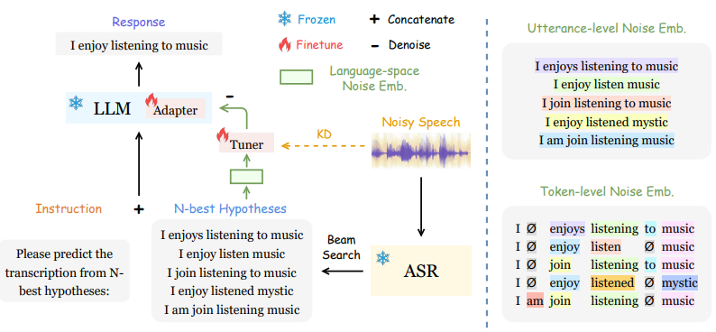

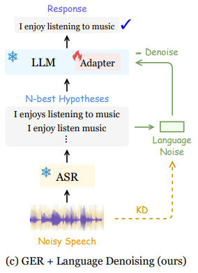

Noisy speech is sent into pre-trained ASR model to generate N-best hypotheses

Extract a language-space noise embedding from the N-best list to represent the noise conditions of source speech
- Measures the diversity of the N-best hypotheses on the utterance and token levels (noise information in input speech)

Design a KD approach to distill real noise information in source speech to enhance noise representation ability, for the extracted language-space noise embedding

Employ the audio embedding from the ASR encoder for distillation

Add an instruction to the N-best hypotheses and send them into the LLM to predict the true transcription with the language embedding incorporated for denoising

Add a minus sign before the noise embedding to indicate "denoise": Teach LLM to do language-space denoising

Hypotheses-to-transcription-Mapping-Function(N-best-list - language-space-noise-embedding): Follow Llama-Adapter

**Language-Space Noise Embedding**

Extract <u>language-space</u> noise embedding from N-best hypotheses to represent the noise conditions of source speech, avoiding directly incorporating audio-space noise embedding into LLM finetuning as that could harm its stability and performance

Extract noise embedding on 2 levels across the N-best list:
1. Utterance-Level

    Obtain sentence embeddings using SBERT encoder
    
    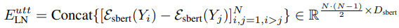

    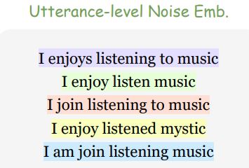

    Concatenates all sentence embedding differences (calculate difference only when i > j in the hypotheses list)
    - Pairwise differences reflect how far the poorer hypotheses are from the better ones, which gives a sense of language noise.
    - Worse noisy speech would lead to larger ASR decoding uncertainty and thus more diverse N-best
hypotheses, so that the equation can capture larger diversity embedding
     
    Computing an embeding that captures the diveristy/noise among the transcription hypotheses

2. Token-Level
   
    Force-align the N-best hypotheses to the same length with padding "Ø" (how???)

    This clearly illustrates the token difference between the different candidates

    SBERT is used to extract token embedding

    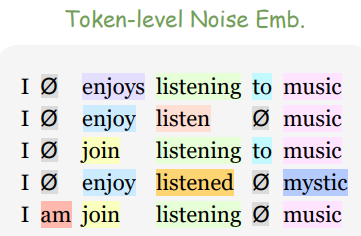

    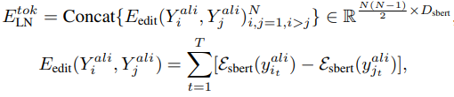

    First design an edit embedding difference to capture the token-level difference between 2 hypothesis

    Use this to calculate the token-level noise embedding by summing up the edit embedding between
different pairs of hypotheses in the N-best list

Combine the 2 embeddings to form the resulted noise embedding ```language-space-noise-embedding = [language-space-utterance-embedding,language-space-token-embedding]```

sentence-BERT (SBERT) is used to obtain the embeddings from raw text

**Audio Noise Distillation via Mutual Information Neural Estimation (MINE)**

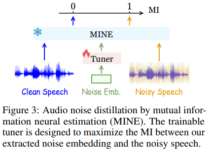

<u>Tuner</u>

The tuner (a neural network) is trained to adjust the noise embeddings in order to maximise the mutual information (MI) between the noise embedding and noisy speech based on the feedback from MINE
- Ensures that the noise information in the noise embedding is aligned as closely as possible with the noise present in the noisy speech

<br/>

<u>Mutual Information Neural Estimation</u>

Use extracted language-space-noise-embedding and noisy-audio-embedding as the Joint Distribution: 
- Represents the relationship between 2 variables, the noisy speech and noise embeddings (treated as a pair)
- Tells us the probability of observing a particular noisy speech sample together with its corresponding noise embedding
- Goal is to maximise

Use extracted language-space-noise-embedding and clean-audio-embedding as the Marginal Distribution:
- Represents the independence between 2 variables, the clean speech and noise embeddings (treated as separate), how they occur independently
- Goal is to minimise: Make sure the noise embedding doesn’t capture anything about the clean speech. Noise embedding should only capture noise and not speech-related information.

Both are needed because of the MI equation

MINE first learns to learn accurate MI estimation using both the positive and negative sample pairs

Then, the learnable tuner modulates the language-space-noise-embedding to capture more real noise information by maximising the MI between the language-space-noise-embedding and noisy-audio-embedding

Tuner uses these MI scores to tune the noise embeddings:
- Maximise MI between noise embeddings and noisy speech
- Mininmise MI between noise embeddings and clean speech

Clean speech is only used during training
-  help the system understand what speech without noise sounds like. It's used during training to compare against the noisy speech.

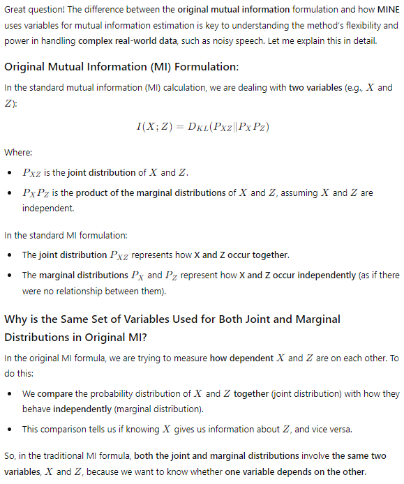
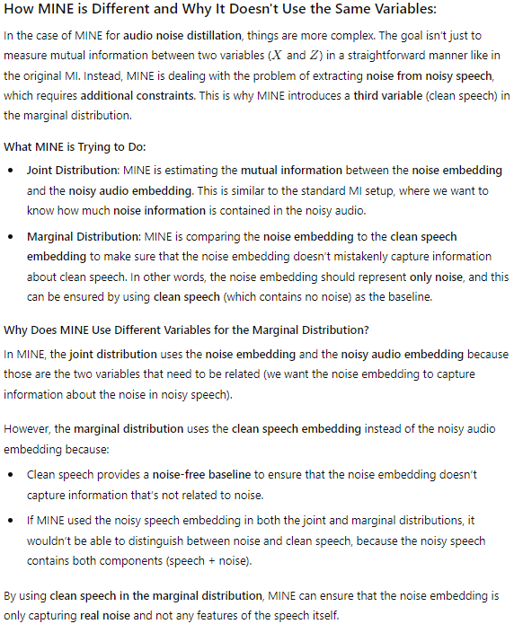
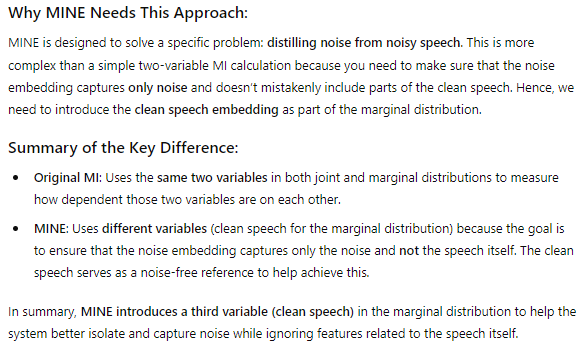

<br/>
<br/>

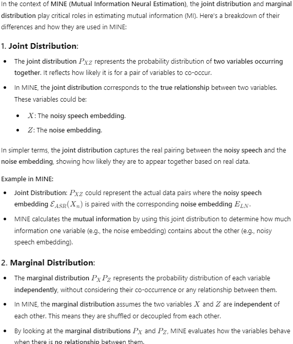
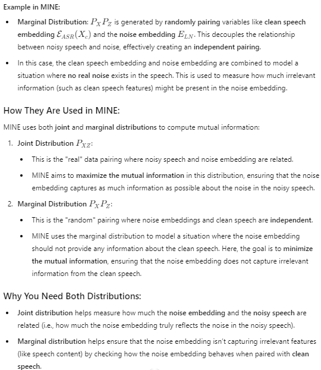
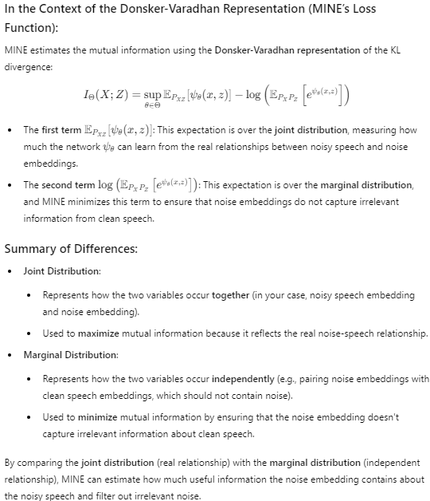

<br/>
<br/>
<br/>


**Related Work**

The latest works find that directly introducing other modalities into LLMs could harm the finetuning stability
and performance due to the heterogeneous cross-modality gap. Therefore, this work proposes to extract a language embedding from the N-best list <u>to represent audio noise</u>, which works well in teaching LLMs to perform denoising.


